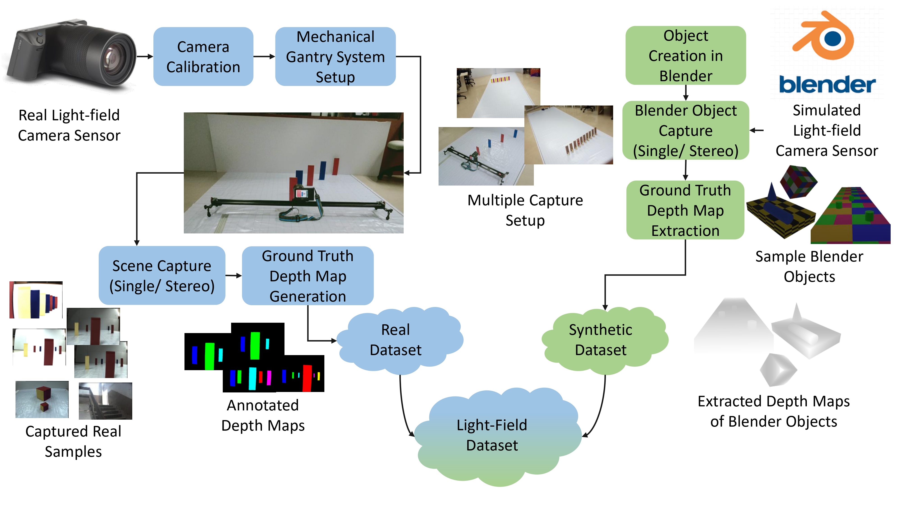

# Light-Field Dataset for Disparity Based Depth Estimation (ICVGIP 2025)

Official repository for the dataset introduced in the paper: [Paper Link](https://arxiv.org/abs/2511.05866)

## Overview

This repository provides the dataset presented at ICVGIP 2025 to support
research in computer vision, deep learning, and 3D scene understanding.

This repository provides the dataset introduced in our ICVGIP 2025 paper. 
The dataset is designed to support research in:
- Computer Vision
- Image Processing
- Light Field Image Analysis
- Deep Learning-based methods

The dataset includes carefully curated samples, annotations, and evaluation protocols to facilitate benchmarking and reproducible research.

## Use Cases

The dataset can be used for:

- Depth estimation
- Super-resolution
- Scene understanding
- Light field research
- 3D reconstruction
- Benchmarking vision models

## Graphical Abstract

<p align="center">  </p>

## Dataset Download

IEEE DataPort: [Click Here](https://dx.doi.org/10.21227/bbfq-kg28)

Google Drive: [Click Here](https://drive.google.com/file/d/1xmQHv_vkJ0uiyPdMw6mX5G-cq8rs1Z3b/view?usp=sharing)

## Citation

If you use this dataset in your research, please cite our paper:

```
@inproceedings{nehra2025light,
  title={Light-Field Dataset for Disparity Based Depth Estimation},
  author={Nehra, Suresh and Kar, Aupendu and Mukhopadhyay, Jayanta and Biswas, Prabir Kumar},
  booktitle={Proceedings of the 16th Indian Conference on computer vision, graphics and image processing},
  pages={1--8},
  year={2025}
}

@data{bbfq-kg28-26,
  doi = {10.21227/bbfq-kg28},
  url = {https://dx.doi.org/10.21227/bbfq-kg28},
  author = {Suresh Nehra and Aupendu Kar and Jayanta Mukhopadhyay and Prabir Kumar Biswas},
  publisher = {IEEE Dataport},
  title = {Light-Field Dataset for Disparity Based Depth Estimation},
  year = {2026}
}
```

ArXiv version:
```
@article{nehra2025light,
  title={Light-Field Dataset for Disparity Based Depth Estimation},
  author={Nehra, Suresh and Kar, Aupendu and Mukhopadhyay, Jayanta and Biswas, Prabir Kumar},
  journal={arXiv preprint arXiv:2511.05866},
  year={2025}
}
```

## License

This dataset is released for research purposes only.

